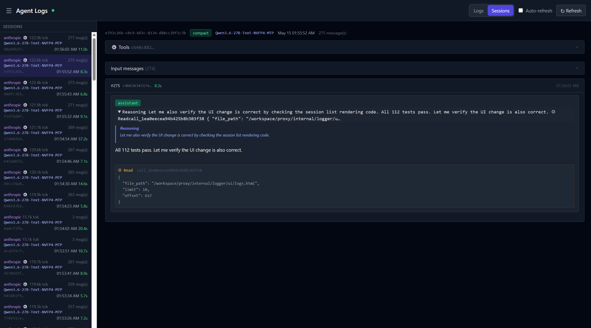

# lazy-vllm-proxy

A lightweight reverse proxy that routes OpenAI-compatible and Anthropic API requests to one or more vLLM backends.

## What it does

- Accepts `/v1/chat/completions` (OpenAI format) and `/v1/messages` (Anthropic format) endpoints
- Routes requests to upstream vLLM instances based on model name
- **Flash models**: Automatically exposes `-FLASH` variants of every backend model that disable thinking mode for instant responses
- **Token-based routing**: Optionally upgrades requests to a different model when input tokens exceed a threshold
- Captures request/response payloads to disk for debugging and observability
- Provides a web UI to browse captured logs

## Quick start

```bash
export BACKENDS_MAP='[{"name":"gemma","url":"http://localhost:8000"},{"name":"qwen","url":"http://localhost:8001"}]'
export PORT=8002
export LOG_DIR=./logs          # optional: enable disk logging
./lazy-vllm-proxy
```

Then point any OpenAI/Anthropic SDK client at `http://localhost:8002`.

## Configuration

| Variable | Description | Default |
|----------|-------------|---------|
| `BACKENDS_MAP` | JSON array of `{name, url}` backend definitions | **required** |
| `PORT` | HTTP listen port | `8002` |
| `LOG_DIR` | Directory for persisted request/response logs (SQLite DB) | none (disabled) |
| `LOG_LEVEL` | Log verbosity: DEBUG, INFO, WARN, ERROR | `INFO` |
| `ROUTING_RULES` | JSON array of `{source_model, threshold, target_model}` rules | none |

`BACKENDS_MAP` is matched by exact `name` — if no match, the first backend is used as fallback.

### Routing Rules

`ROUTING_RULES` lets you upgrade requests to a different model when the input exceeds a token threshold:

```bash
export ROUTING_RULES='[{"source_model":"claude-sonnet-4-6","threshold":32000,"target_model":"claude-opus-4-7"}]'
```

When a request for `claude-sonnet-4-6` has ≥32,000 input tokens, it gets routed to `claude-opus-4-7` instead.

## Flash Models

Every backend model is automatically duplicated with a `-FLASH` suffix (e.g., `gemma-FLASH`). Flash requests route to the same backend but with `chat_template_kwargs: {"enable_thinking": false}` injected — disabling chain-of-thought for instant responses.

```bash
# Normal (with thinking)
curl -X POST http://localhost:8002/v1/chat/completions \
  -d '{"model":"RedHatAI/Qwen3.6-35B","messages":[{"role":"user","content":"Solve this"}]}'

# Flash (no thinking, instant)
curl -X POST http://localhost:8002/v1/chat/completions \
  -d '{"model":"RedHatAI/Qwen3.6-35B-FLASH","messages":[{"role":"user","content":"Solve this"}]}'
```

The `/v1/models` endpoint lists both original and `-FLASH` variants.

## Logging

Captured logs are stored in a SQLite database (`logs.db`) using the pure-Go `modernc.org/sqlite` driver — no CGo required.
The schema uses versioned migrations via `PRAGMA user_version` so it can evolve without manual upgrades.
WAL mode is enabled for concurrent reads during writes.

When `LOG_DIR` is set, every request is indexed by `started_at` and queryable via the `/api/logs` and `/api/logs/{id}` endpoints,
which serve the JSON consumed by the web UI at `/ui/logs`.

### Compact Logging

The proxy also maintains a compact logging database (`compact_logs.db`) with O(n) storage:

- **Global message deduplication**: Messages are hashed by SHA256(body) — identical messages across sessions share a single row.
- **Tools deduplication**: Tool definitions are stored once globally, referenced by hash from sessions.
- **Session metadata**: Each session tracks format (OpenAI/Anthropic), model name, and token count.
- **Message timing**: Each message in a session records its duration in milliseconds — input messages are `0`, the assistant's output message carries the upstream response latency.



## Endpoints

| Path | Method | Description |
|------|--------|-------------|
| `/v1/chat/completions` | POST | OpenAI-compatible chat completions |
| `/v1/messages` | POST | Anthropic-compatible messages |
| `/v1/models` | GET | List available models (includes `-FLASH` variants) |
| `/health` | GET | Health check (200 OK) |
| `/metrics` | GET | Prometheus metrics |
| `/log-level` | POST | Runtime log level change (`{"level":"DEBUG"}`) |
| `/ui/logs` | GET | Web UI for browsing captured logs |
| `/api/logs` | GET | JSON list of captured log summaries |
| `/api/logs/{id}` | GET | JSON detail of a specific log |
| `/api/sessions` | GET | JSON list of compact logger sessions |
| `/api/sessions/{id}` | GET | Session detail with message chain |
| `/api/tools/{hash}` | GET | Tools JSON blob by hash |

## Catch-all proxy

Any unrecognized path falls through to a generic proxy handler, which forwards the request to the backend resolved by the `model` field in the request body. This lets the proxy handle arbitrary backend endpoints transparently.
